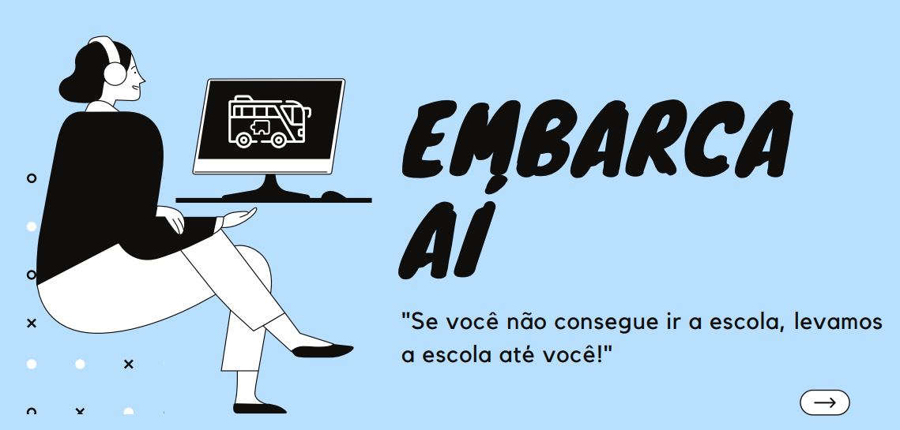
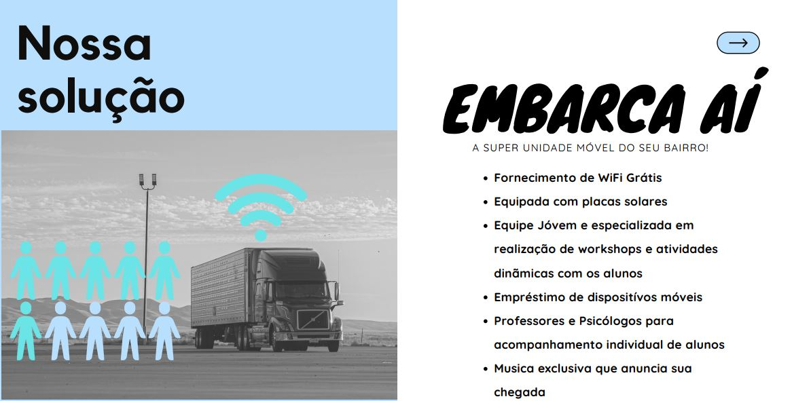
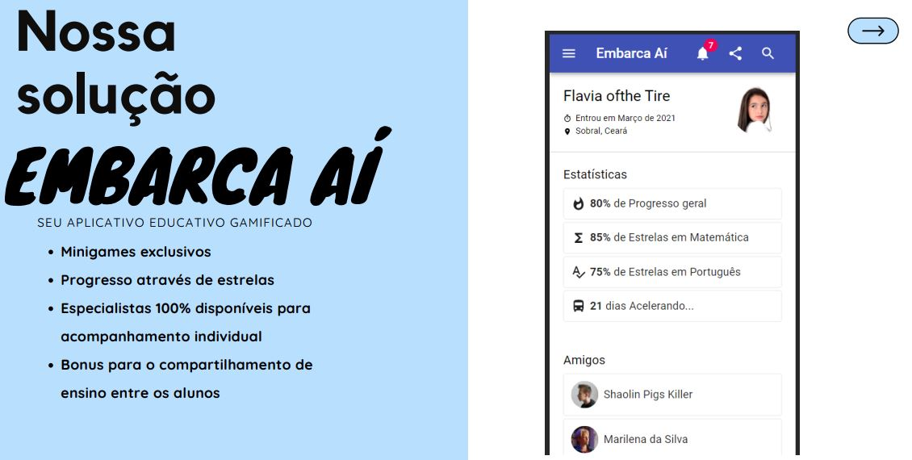

# 
Embarca Aí

<i>"Se você não consegue ir a escola, levamos a escola até você!"</i>
Solução desenvolvida como proposta ao Hackathon Batalha de Dados Itaú 2021.

## Problemas encontrados
- Estrutura arcaica das escolas
- Falta de visibilidade
- Advento da Pandemia do COVID-19
  
## Cenário atual
- Defasagem dos alunos do ensino médio
- Investimentos do governo de quase R$ 42,8 bilhões
- Desfalque no acesso a internet

## 🤝 Todos juntos pela educação
- <b>Investimento privado</b>: O App servirá de Marketplace para anúncios de empresas tanto da área de educação, saúde mental e jogos infantojuvenis
- <b>Investimento público</b>: Reforma de ônibus escolares através de financiamento de órgaõs publicos em parceria de empresas privadas
- <b>Clientes</b>: Empresas de transporte, de tecnologia e de ensino

## ⚙ Tecnologias

- [React](https://reactjs.org/)
  

 ## 💪 Time
  - Andrés Ortega (UX Designer)  [LinkedIn](https://www.linkedin.com/in/andr%C3%A9sortega/) . [Behance](https://www.behance.net/andres0rtega)
  - Daniel Cherutti (Eng. de Dados) [LinkedIn](https://www.linkedin.com/in/daniel-cherutti-739180180/) . [GitHub](https://github.com/cheruttinho)
  - Danilo Oliveira (Cientista Modelador) [Linkedin](https://www.linkedin.com/in/danilo-oliveirads/) . [GitHub](https://github.com/Danilotve)
  - Vinicius Passos (Dev) [LinkedIn](https://www.linkedin.com/in/vtpa/) . [GitHub](https://github.com/vtpa)

## 🙏 Agradecimentos
Gostaríamos de agradecer a todos os patrocinadores do eventos e especialmente a Monitora Simone que nos garantiu diversos insights e encaminhametos.